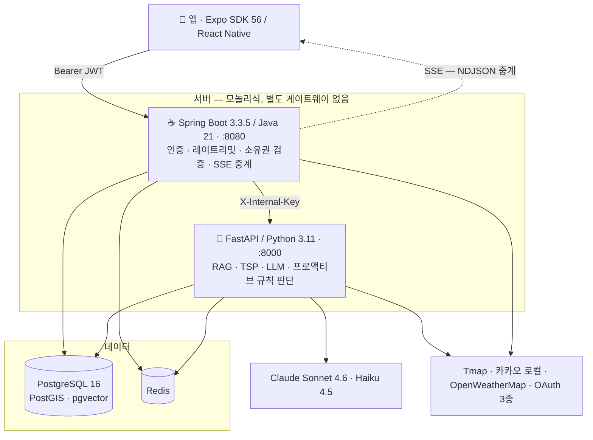

<div align="center">

# Cloumy

**목적지와 날짜만 넣으면 AI가 나만의 루트를 짜주는 여행 원스톱 앱**


</div>

---

## 소개

방한 외국인 관광객이 언어·정보 장벽 없이 한국을 깊이 경험할 수 있도록, AI가 루트를 짜고 여행 중 실시간으로 돕는 올인원 여행 실행 앱입니다.
(2026-07-06 타겟 전환: 한국인 국내 여행자 → 방한 외국인 관광객(미국·일본·중국·대만), 상세는 `planning/strategy.md` 참고)

| 페르소나 | 기존 | Cloumy |
|----------|------|--------|
| 미국 K-pop 팬 Sarah | K-pop 성지는 정했는데 나머지 일정을 못 채움 | 취향 태그 기반 AI가 나머지 일정 자동 완성 |
| 일본 재방문자 Yui | 매번 같은 코스, 숨은 명소 발굴 어려움 | 유저 공유 루트 + 한국어 리뷰 자동 해석 |
| 중국 자유여행자 Wei | 결제·교통 등 기본 정보에서 계속 막힘 | 중국어 챗봇에 즉시 질문 → 실시간 답변 |

---

## 주요 기능

| 기능 | 설명 |
|------|------|
| 🤖 AI 루트 자동 생성 | 목적지·날짜·스타일 입력 → LLM + RAG + TSP 동선 최적화 |
| 📌 Pin & Reshuffle | 마음에 드는 일정은 고정, 싫은 슬롯만 AI 재추천 |
| 💬 AI 챗봇 | 여행 전 대화형 플래닝 + 여행 중 실시간 대응 |
| 💰 예산 관리 | 계획/비계획 지출 분리 추적, 예산 초과 시 챗봇 대안 제시 |
| 🔮 Hidden Gems | GPS 인증(반경 100m) 기반 현지인 숨은 명소 등록·공유 |
| 👥 그룹 여행 | 실시간 동기화, 일정 투표, 개인 지출 추적 |

---

## 스크린샷

> Coming Soon — MVP 출시 후 업데이트 예정

---

## 아키텍처

### 레이어 구성

<table>
  <tr>
    <td align="center" width="33%">
      <b>📱 클라이언트</b><br/><br/>
      <br/>
      <sub>React Native · Expo · TypeScript</sub>
    </td>
    <td align="center" width="33%">
      <b>🔀 API Gateway</b><br/><br/>
      <br/>
      <sub>Nginx · 리버스 프록시 · HTTPS</sub>
    </td>
    <td align="center" width="33%">
      <b>🚀 인프라 / CI·CD</b><br/><br/>
      <br/>
      <sub>Docker · GitHub Actions · AWS</sub>
    </td>
  </tr>
  <tr>
    <td align="center">
      <b>⚙️ 백엔드</b><br/><br/>
      <br/>
      <sub>Spring Boot 3.x · Java 21</sub>
    </td>
    <td align="center">
      <b>🤖 AI 서비스</b><br/><br/>
      <br/>
      <sub>FastAPI · LangChain · OR-Tools · Claude</sub>
    </td>
    <td align="center">
      <b>🗄️ 데이터</b><br/><br/>
      <br/>
      <sub>PostgreSQL + pgvector + PostGIS · Redis · S3</sub>
    </td>
  </tr>
</table>

<br/>

### 전체 흐름



> 루트 생성 시퀀스와 설계 판단(ADR)은 [`docs/02-architecture.md`](./docs/02-architecture.md) 참고.

### 서비스 간 통신

| 구간 | 프로토콜 | 비고 |
|------|----------|------|
| 클라이언트 ↔ Spring | HTTPS REST + SSE | 일반 API 요청 + 루트 생성 스트리밍 프록시 |
| Spring ↔ FastAPI | HTTP ndjson (내부) | `X-Internal-Key` 헤더 인증, SSE 스트리밍 프록시 |
| 클라이언트 ↔ Spring (챗봇) | WebSocket | 챗봇 스트리밍 (Phase 2) |
| 그룹 여행 동기화 | WebSocket + Redis Pub/Sub | 실시간 일정 공유 |

### MVP → MSA 전환 전략

| 단계 | 구조 | 시점 |
|------|------|------|
| MVP 초반 | Spring 모놀리식 + FastAPI 분리 | 0~3개월 |
| MVP 후반 | Auth · Trip · Community 서비스 분리 | 3~6개월 |
| Phase 2 | 완전한 MSA + ECS Fargate + Kafka | MAU 기반 병목 확인 후 |

---

## 기술 스택

| 영역 | 기술 | 결정 이유 |
|------|------|----------|
| 모바일 | React Native + Expo | TypeScript 생태계, OTA 핫픽스, iOS·Android 동시 개발 |
| 백엔드 | Spring Boot 3.x / Java 21 | 복잡한 여행 데이터 쿼리, PostGIS 연동 안정적 |
| AI 서비스 | Python FastAPI + LangChain | AI 파이프라인이 Python 생태계에 최적화 |
| LLM | Claude Sonnet 4.6 / Haiku 4.5 | 기능별 모델 라우팅 (비용 최적화) |
| 임베딩 | OpenAI text-embedding-3-small | Anthropic 임베딩 미출시, 비용 효율 최적 |
| DB | PostgreSQL + PostGIS + pgvector | 지리 데이터 + 벡터 검색 단일 DB로 처리 |
| 캐시 | Redis | 챗봇 세션, 장소 캐시(TTL 24h), JWT 블랙리스트 |
| 인증 | JWT + OAuth 2.0 | 구글·애플 우선 (카카오는 국내 전용이라 보류, 재검토 필요) |
| 결제 | ⚠️ PG 미확정 | 토스페이먼츠는 국내 전용이라 재검토 필요 — Stripe 등 국제결제 검토 중 |
| 인프라 | AWS EC2 → ECS Fargate | MVP EC2 단일 → 트래픽 증가 후 Fargate 전환 |

---

## 프로젝트 구조

```
cloumy/
├── frontend/                  # React Native (Expo)
├── backend/                   # Spring Boot
│   └── src/main/java/com/cloumy/
│       ├── auth/              # JWT · 소셜 로그인
│       ├── trip/              # 루트 · 일정
│       ├── community/         # Hidden Gems · 피드
│       ├── budget/            # 예산 · 지출
│       ├── payment/           # 트립 패스 · 결제
│       └── common/            # 공통 예외 · 응답 포맷
├── ai/                        # Python FastAPI
│   └── app/
│       ├── routes/            # 엔드포인트
│       ├── services/          # RAG · TSP · 챗봇
│       ├── models/            # Pydantic 모델
│       └── config/            # 환경 설정
├── db/                        # PostgreSQL 초기화 스크립트 · nginx.conf (리버스 프록시)
├── docs/                      # 기획서 · API 명세 · 데이터 모델
├── planning/                  # 마일스톤 · 우선순위
├── docker-compose.yml
└── .env.example
```

---

## 로컬 개발 환경

### 사전 요구사항

- Docker & Docker Compose
- Java 21
- Python 3.11+
- Node.js 20+

### 시작하기

```bash
# 1. 레포 클론
git clone https://github.com/dlwldn30/cloumy.git
cd cloumy

# 2. 환경 변수 설정
cp .env.example .env          # Spring 환경 변수
cp ai/.env.example ai/.env   # FastAPI 환경 변수
# 각 .env 파일을 열어 API 키 입력

# 3. 전체 스택 실행 (DB + Redis + Spring + FastAPI 빌드 포함)
make up   # 첫 실행 시 빌드 3~5분 소요

# ── 개발 모드 (코드 반복 수정 시 권장) ──────────────────────
# DB·Redis만 Docker로 올리고 앱은 직접 실행
docker compose up -d postgres redis

# Spring (백엔드)
cd backend && ./gradlew bootRun

# FastAPI (AI 서비스)
cd ai
python -m venv .venv && source .venv/bin/activate
pip install -r requirements.txt
uvicorn app.main:app --reload
```

### 환경 변수

`.env.example`을 참고해 `.env`를 만들어 주세요.

| 변수 | 설명 | 필수 |
|------|------|------|
| `POSTGRES_PASSWORD` | DB 비밀번호 | ✅ |
| `JWT_SECRET` | JWT 서명 키 (32자 이상 랜덤 문자열) | ✅ |
| `INTERNAL_API_KEY` | Spring ↔ FastAPI 내부 통신 키 | ✅ |
| `ANTHROPIC_API_KEY` | Claude API 키 | ✅ |
| `OPENAI_API_KEY` | 임베딩 전용 (text-embedding-3-small) | ✅ |
| `KAKAO_REST_API_KEY` | 카카오 로컬 API (계속 사용) · OAuth(⚠️ 국내 전용이라 보류) | ✅ |
| `GOOGLE_MAPS_API_KEY` | 지도 렌더링 | 지도 기능 시 |
| `TOSS_PAYMENTS_SECRET_KEY` | 결제 — ⚠️ PG 미확정, 국제결제 검토 중 | 결제 기능 시 |
| `OPENWEATHERMAP_API_KEY` | OpenWeatherMap (날씨) | 챗봇 날씨 연동 시 |

---

## 비즈니스 모델

AI 루트 생성·저장은 **트립 패스** 결제 후 사용 가능합니다.
미리보기는 패스 없이도 무료로 제공하며, 신규 가입 시 첫 여행은 전 기능 무료로 사용할 수 있습니다.

| 상품 | 가격 | 대상 |
|------|------|------|
| Standard | $4.99 | AI 루트 저장·편집, 챗봇, 예산 관리, 지도 내비, 루트 공유 |
| Extended | $7.99 | Standard 전체 + 오프라인 저장, AI 여행 일지 (Phase 2) |

> ⚠️ 결제 수단(PG) 미확정 — 토스페이먼츠는 국내 전용이라 재검토 필요, Stripe 등 국제결제 검토 중 (`docs/02-architecture.md` ADR-6 참고)

---

## 로드맵

### Phase 0 — 환경 설정 (Week 1~2)
- [x] 모노레포 구조 세팅
- [x] Docker Compose 로컬 환경 (PostgreSQL + pgvector, Redis)
- [x] Spring Boot 프로젝트 초기화
- [x] JWT + OAuth 2.0 인증 구현
- [x] 트립 패스 검증 로직
- [x] GitHub Actions CI/CD
- [x] FastAPI 프로젝트 초기화
- [ ] React Native + Expo 초기화
- [x] DB 스키마 마이그레이션 (Flyway, V1~V5)

### Phase 1 — 데이터 파이프라인 + AI 루트 생성 (Week 3~10)
- [x] TourAPI 데이터 수집기 (20,363건) — 2026-06-21
- [ ] 카카오 로컬 / KOPIS 데이터 수집기
- [ ] OpenAI 임베딩 생성 → pgvector 저장
- [x] LangChain LCEL + PostgisTagRetriever Phase A — 2026-06-21
- [x] Spring SSE 스트리밍 프록시 (루트 생성) — 2026-06-22
- [ ] RAG 파이프라인 Phase B (PgvectorRetriever 교체)
- [ ] OR-Tools TSP 동선 최적화
- [ ] 슬롯 대안 추천 (🔄)
- [ ] 지도 시각화 (react-native-maps)

### Phase 2 — AI 챗봇 + 예산 관리 (Week 9~14)
- [ ] LangChain 멀티턴 챗봇
- [ ] Function Calling (장소 검색, 지출 기록, 대안 추천)
- [ ] 예산 자연어 파싱 (Haiku)
- [ ] Hidden Gems + 태그 커뮤니티
- [ ] GPS 인증 (반경 100m 서버 사이드 검증)

### Phase 3 — 결제 + 그룹 모드 + 출시 (Week 15~18)
- [ ] ⚠️ 토스페이먼츠 웹뷰 결제 — 재검토 필요(국내 전용 PG, 국제결제 검토 중)
- [ ] ⚠️ 소셜 로그인 완성 — 구글·애플 우선, 카카오는 국내 전용이라 보류
- [ ] 그룹 여행 모드 (WebSocket + Redis Pub/Sub)
- [ ] 오프라인 저장 (4박 이상 패스)
- [ ] 앱스토어 · 플레이스토어 심사 제출

---

## 개발 가이드

### 브랜치 전략

```
main                        # 배포 브랜치
feat/이슈번호-작업-내용      # 새 기능
fix/이슈번호-작업-내용       # 버그 수정
chore/이슈번호-작업-내용     # 설정·빌드·운영
```

### 커밋 컨벤션

모노레포 구조에서 어느 스택을 건드렸는지 알 수 있도록 커밋 메시지에 **스택 prefix**를 붙인다.
브랜치·PR은 기능 단위로 하나만 만들고, 커밋에서 레이어를 구분한다.

```
feat: ✨ [AI] hidden_gem_ratio 시스템 프롬프트 반영
feat: ✨ [Spring] hiddenGemRatio DTO + cacheKey 전달
feat: ✨ [Frontend] Step 3 장소 성향 선택 UI
fix:  🔨 [Spring] 피드 조회 500 에러 수정
chore: 🧹 [Infra] Docker Compose postgres 포트 수정
docs: 📝 [공통] README 개발 가이드 업데이트
refactor: ♻️ [AI] 루트 서비스 캐시 키 정규화
```

**스택 목록:** `[AI]` · `[Spring]` · `[Frontend]` · `[Infra]` · `[DB]` · `[공통]`

### 이슈 & PR

```
이슈:   [✨ Feat] 로그인 API 구현
브랜치: feat/12-login-api
PR:     [✨ Feat] 로그인 API 구현 (#12)
```

PR 본문에 `Closes #이슈번호` 필수 (merge 시 이슈 자동 닫힘)

---

## 문서

| 파일 | 내용 |
|------|------|
| `docs/00-overview.md` | 프로젝트 개요 · 비즈니스 모델 · KPI |
| `docs/01-prd.md` | 기능 명세 · 우선순위 (P0/P1/P2) |
| `docs/02-architecture.md` | 시스템 구조 · 기술 결정 (ADR) |
| `docs/03-data-model.md` | DB 스키마 · 엔티티 정의 |
| `docs/04-api-spec.md` | API 엔드포인트 명세 |
| `planning/milestones.md` | Phase별 개발 마일스톤 (18주) |

---

## 라이선스

© 2026 Cloumy. All rights reserved.
